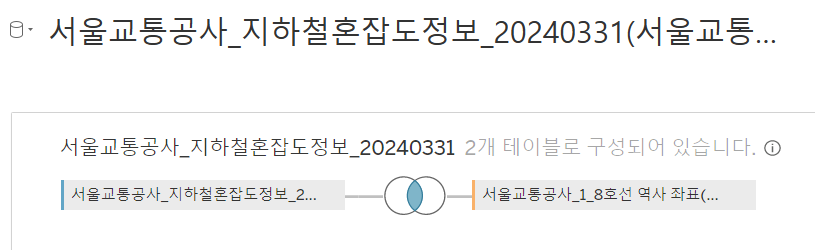
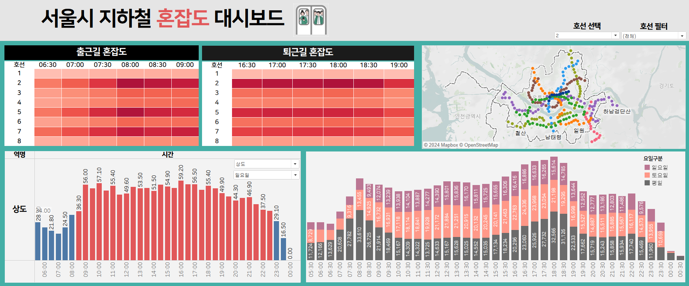

# 대시보드 만들기

https://public.tableau.com/views/_17231018332120/sheet7?:language=ko-KR&publish=yes&:sid=&:redirect=auth&:display_count=n&:origin=viz_share_link

## 사용한 데이터 셋

- 서울교통공사_지하철혼잡도정보(1~8호선)
- 서울교통공사 1~8호선 역사 좌표를 JOIN 해서 위경도 표시

- 서울교통공사 1-8호선 30분 단위 평균 혼잡도
    - 30분간 지나는 열차들의 평균 혼잡도(정원대비 승차인원으로, 승차인과 좌석수가 일치할 경우를 혼잡도 34%로 산정)

## 대시보드 설명

1. 서울시 1~8호선 역사 위경도를 활용하여 노선 시각화 (마크 : 라인으로 설정하니 순서를 인식 못함.. 추후 수정 필요)

2. 출근길과 퇴근길의 혼잡도 히트맵 작성

3. 해당 역 선택시 혼잡도의 합이 34 이상이면 빨강 <-> 이하이면 파란색으로 표시

4. 시간대별 (평일 / 토요일 / 일요일) 혼잡도 추이 비교

