# Third Study Week

- 20강: [파이와 도넛차트](#20강-파이와-도넛차트)

- 21강: [워드와 버블차트](#21강-워드와-버블차트)

- 22강: [이중축과 결합축](#22강-이중축과-결합축)

- 23강: [분산형 차트](#23강-분산형-차트)

- 24강: [히스토그램](#24강-히스토그램)

- 25강: [박스플롯](#25강-박스플롯)

- 26강: [영역차트](#26강-영역차트)

- 27강: [간트차트](#27강-간트차트)

- 28강: [필터](#28강-필터)

- 29강: [그룹](#29강-그룹)


- 문제1 : [문제1](#문제1)

- 문제2 : [문제2](#문제2)

- 참고자료 : [참고자료](#참고-자료)


## Study Schedule

| 강의 범위     | 강의 이수 여부 | 링크                                                                                                        |
|--------------|---------|-----------------------------------------------------------------------------------------------------------|
| 1~9강        |  ✅      | [링크](https://youtu.be/3ovkUe-TP1w?si=CRjj99Qm300unSWt)       |
| 10~19강      | ✅      | [링크](https://www.youtube.com/watch?v=AXkaUrJs-Ko&list=PL87tgIIryGsa5vdz6MsaOEF8PK-YqK3fz&index=75)       |
| 20~29강      | ✅      | [링크](https://www.youtube.com/watch?v=Qcl4l6p-gHM)      |
| 30~39강      | 🍽️      | [링크](https://www.youtube.com/watch?v=e6J0Ljd6h44&list=PL87tgIIryGsa5vdz6MsaOEF8PK-YqK3fz&index=55)       |
| 40~49강      | 🍽️      | [링크](https://www.youtube.com/watch?v=AXkaUrJs-Ko&list=PL87tgIIryGsa5vdz6MsaOEF8PK-YqK3fz&index=45)       |
| 50~59강      | 🍽️      | [링크](https://www.youtube.com/watch?v=AXkaUrJs-Ko&list=PL87tgIIryGsa5vdz6MsaOEF8PK-YqK3fz&index=35)       |
| 60~69강      | 🍽️      | [링크](https://www.youtube.com/watch?v=AXkaUrJs-Ko&list=PL87tgIIryGsa5vdz6MsaOEF8PK-YqK3fz&index=25)       |
| 70~79강      | 🍽️      | [링크](https://www.youtube.com/watch?v=AXkaUrJs-Ko&list=PL87tgIIryGsa5vdz6MsaOEF8PK-YqK3fz&index=15)       |
| 80~89강      | 🍽️      | [링크](https://www.youtube.com/watch?v=AXkaUrJs-Ko&list=PL87tgIIryGsa5vdz6MsaOEF8PK-YqK3fz&index=5)        |


<!-- 여기까진 그대로 둬 주세요-->
<!-- 이 안에 들어오는 텍스트는 주석입니다. -->

# Third Study Week

## 20강: 파이와 도넛차트

> **🧞‍♀️ 도넛차트를 생성하는 법을 기록해주세요.**

```
- 파이차트 구성 시 -> 테이블을 구성 비율로 변경해주기 -> 총합계와 같이 비교하기 위해 도넛 차트 구현

1. 열 선반에 0 입력 -> 임의의 축 2개 생성
2. 하나의 축에 모든 마크 제거
3. 나머지 원에 포함된 값 빼고 레이블에 합계 넣기
4. 이중축 선택
5. 나머지 서식 설정 (격자 제거, 머리글 표시 제거)
```
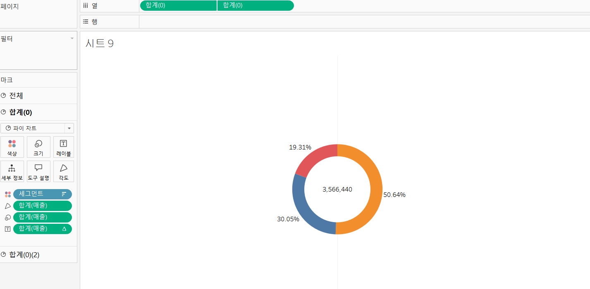

## 21강: 워드와 버블차트
```
[버블차트]
- 국가/지역과 매출 클릭 후 -> 버블 차트 클릭
- 색상 마크을 통해 색 설정 가능
```
```
[워드클라우드]
- 국가/지역 -> 크기 -> 카운트 + 지역을 레이블 필드로 설정
- 크기와 색상 마크를 통해 등장횟수와 매출을 시각화한 워드 클라우드 구현 가능
```

## 22강: 이중축과 결합축
```
[이중축]
- 이중축을 사용하는 경우에는 마크를 각각의 축에 개별적으로 사용 가능

[결합축]
- 하나의 축을 공유하는 차트. 축을 공유하는 측정값을 필요에 따라 추가할 수 있다.
- 가장 큰 범위의 축을 기준으로 표현된다
```
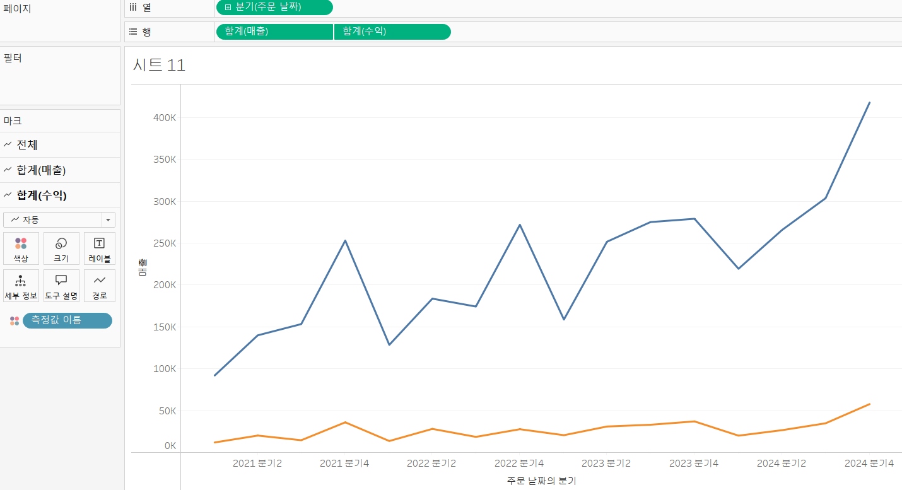
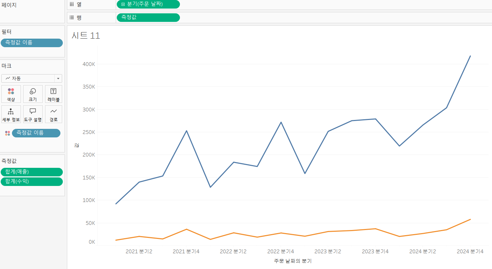


## 23강: 분산형 차트

```
- 파라미터간의 상관관계를 파악하기 유용한 그래프이다.
- 강의에서 예시는 매출과 수익간의 상관관계를 파악함
- 분산형 차트를 그린 후에 추세선 또한 그릴 수 있다.
    + 제품별 추세선과 전체 추세선을 같이 표현하고 싶으면 이중축을 활용하면 됨
```

```js
강의 영상과 달리, 우리 파일에는 '제조 업체' 필드가 없습니다. 필요한 경우, 계산된 필드를 이용해 'SPLIT([제품 이름], ' ', 1)'를 '제조 업체'로 정의하시고 세부 정보에 놓아주세요.
```
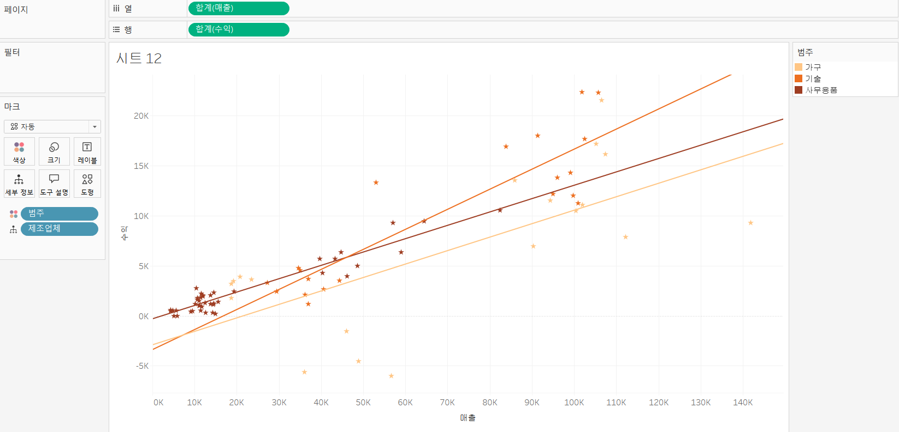

## 24강: 히스토그램

```
- 연속형 측정값을 범위 혹은 구간 차원으로 그룹화함
-  차원필드 없이 측정값만으로 그래프를 그릴 때 주로 사용됨

[시각화 순서]
1. 매출 필드 클릭 -> 만들기 -> 구간차원 (단위 : 100설정)
2. 열 : 구간차원 / 행 : 매출
3. 구간차원은 연속형으로 바꾸기 / 매출 -> 측정값에서 카운트로 변경

or 해당 측정값 클릭 후 -> 표현 방식(히스토그램) 선택하면 더 간편하게 차트 그릴 수 있음
```
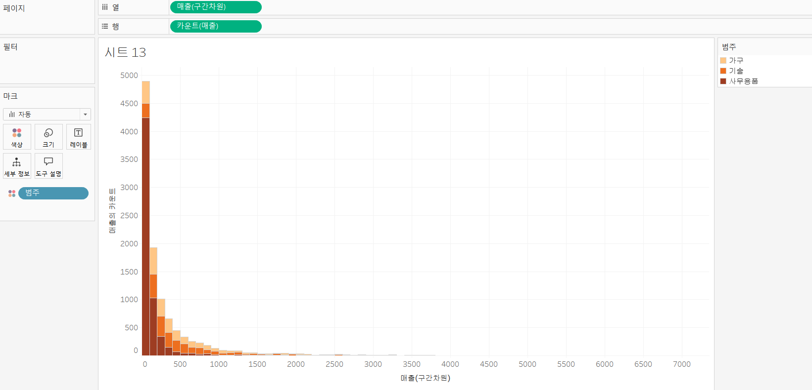

## 25강: 박스플롯

```
열 : '세그먼트' 필드와 '지역' 필드
행 : '매출' 필드
표현 방식 -> 박스 플롯

+ 추가적으로 세그먼트 필드를 색상 마크로 설정하고 고객이름 필드를 세부정보로 드래그 앤 드롭
+ 축 편집에서 로그로 변경해주면 더 깔끔하게 표현 가능
```
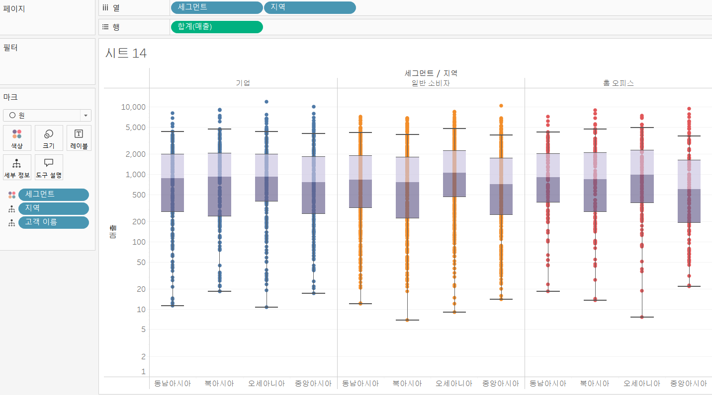

## 26강: 영역차트

```
영역차트 : 라인과 축 사이의 공간이 색상으로 채워진 라인차트
- 주로 연속형 데이터의 누계를 표현하는데 사용됨
- 매출 필드를 세부정보 마크에 드랍 -> 퀵 테이블 계산(구성비율) + 다음을 사용하여 계산(테이블-아래로) 설정
```
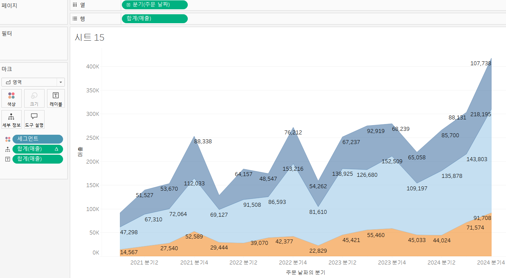

## 27강: 간트차트

```
간트차트 : 시간 경과에 따른 기간을 시각화하는데 주로 사용

- 계산된 필드 -> 배송기간 : DATEDIFF('day',[주문 날짜],[배송 날짜])
- 열 : 월(배송날짜) 불연속형 / 행 : 범주 + 하위 범주
- 배송기간을 크기 마크에 놓고 평균으로 변경
- 고객 이름을 필터 설정 -> 단일값(드롭다운)
-> 필터에서 클릭하는 고객 이름에 따라 간트 차트가 변경됨
```
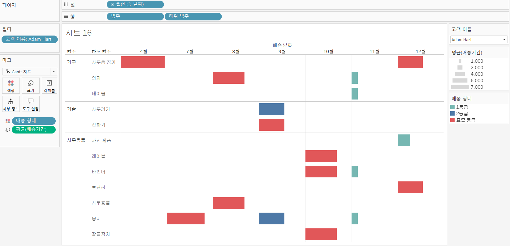

## 28강: 필터

```
필터 실행 순서 : 추출, 데이터원본, 컨텍스트, 차원, 측정값, 필터 순으로 동작

[추출 필터]
- 원본 데이터 -> 연결 -> 추출 클릭 -> 편집 단추 생성

[데이터 원본 필터]
- 작업을 위한 데이터 중 일부만 워크 스페이스에 불러올 때 사용

[컨텍스트 필터]
- 필터 중 상위필터
- 여러가지 필터를 작동했을 때 다른 필터가 컨텍스트 필터에 종속되어 작동한다

- 컨텍스트 필터가 적용되면 필드 색상이 회색으로 변경되고 필터 선반에서 맨 위로 정렬되어 재정렬이 불가능함
- 종속 필터를 선반에 두기 이전에 컨텍스트 필터를 먼저 설정하면 쿼리 속도가 향상됨
```
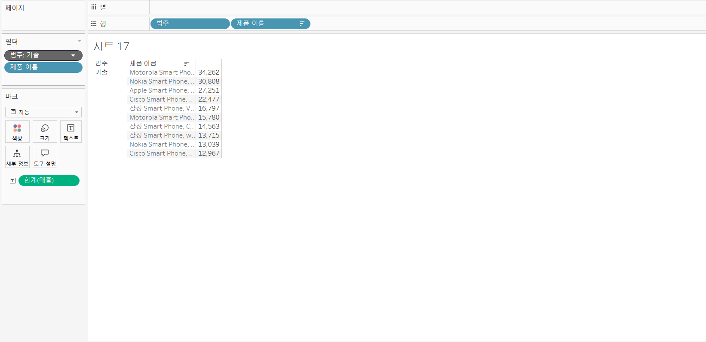

## 29강: 그룹

```
그룹을 이용해 수동으로 필드에 있는 항목들을 묶을 수 있으며, 기존 데이터 원본에 없는 지정 그룹 필드를 만들 수 있다.

1) 뷰에서 만들기
- 뷰에서 특정 부분 드래그 -> 그룹 선택 -> 데이터 필드에 새 필드 추가

2) 항목별로 묶을 필드를 선택해서 만들기
- 해당 항목 필드(제품이름) 마우스 우클릭 -> 만들기 클릭 후 그룹 -> 원하는 대상 선택 후 그룹 각각 만들기
```

## 문제 1.

```js
유정이는 superstore 데이터셋에서 '주문' 테이블을 보고 있습니다.
1) 국가/지역 - 시/도- 도시 의 계층을 생성했습니다. 계층 이름은 '위치'로 설정하겠습니다.
2) 날짜의 데이터 타입을 '날짜'로 바꾸었습니다.

코로나 시기의 도시별 매출 top10을 확인하고자
1) 배송 날짜가 코로나시기인 2021년, 2022년에 해당하는 데이터를 필터링했고
2) 위치 계층을 행으로 설정해 펼쳐두었습니다.
이때, 매출의 합계가 TOP 10인 도시들만을 보았습니다.
```


```
겉보기에는 전체 10개로, 잘 나온 결과처럼 보입니다. 그러나 유정이는 치명적인 실수를 저질렀습니다.
오늘 배운 '컨텍스트 필터'의 내용을 고려하여 올바른 풀이 및 결과를 구해주세요.
```

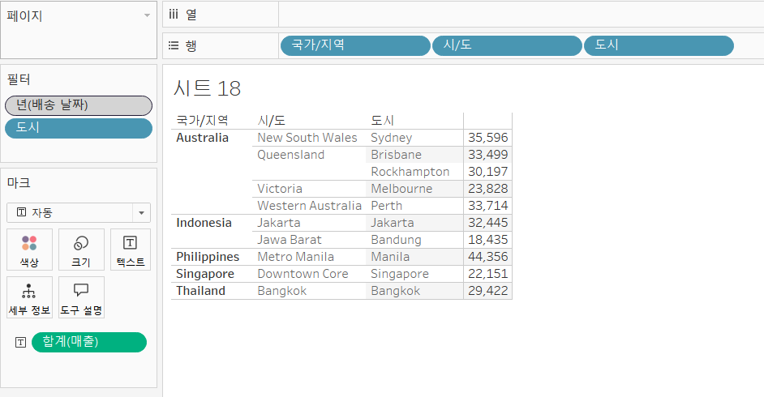

```
[풀이]
: 기존 방식으로 진행하면 년(배송날짜), 도시 필터 2개가 독립적으로 실행된다. 이렇게 되면 모든 년도의 데이터를 기준으로 상위 10개 도시를 구한 셈이다.
하지만 우리가 구하고자 하는 것은 2021년, 2022년 기간 중에서 매출 top10을 구하고 싶은 것이기 때문에 년(배송날짜)를 컨텍스트 필터로 설정해줘야 한다.

```


## 문제 2.

```js
태영이는 관심이 있는 제품사들이 있습니다. '제품 이름' 필드에서 '삼성'으로 시작하는 제품들을 'Samsung group'으로, 'Apple'으로 시작하는 제품들을 'Apple group'으로, 'Canon'으로 시작하는 제품들을 'Canon group'으로, 'HP'로 시작하는 제품들을 'HP group', 'Logitech'으로 시작하는 제품들을 'Logitech group'으로 그룹화해서 보려고 합니다. 나머지는 기타로 설정해주세요. 이 그룹화를 명명하는 필드는 'Product Name Group'으로 설정해주세요.

(이때, 드래그보다는 멤버 찾기 > 시작 문자 설정하여 모두 찾아 한번에 그룹화해 확인해보세요.)
```


- 결과

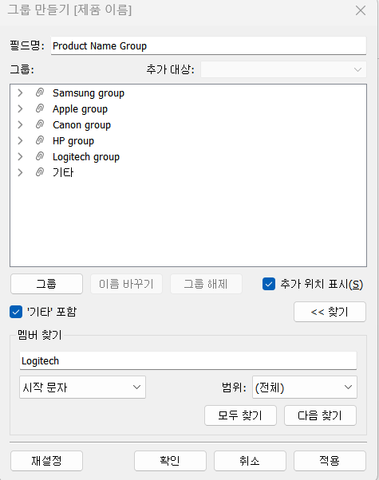

```js
해당 그룹별로 어떤 국가/지역이 주문을 많이 차지하는지를 보고자 합니다. 매출액보다는 주문량을 보고 싶으므로, 주문Id의 카운트로 계산하겠습니다.

기타를 제외하고 지정한 5개의 그룹 하위 목들만을 이용해 아래와 같이 지역별 누적 막대그래프를 그려봐주세요.
```


- 결과
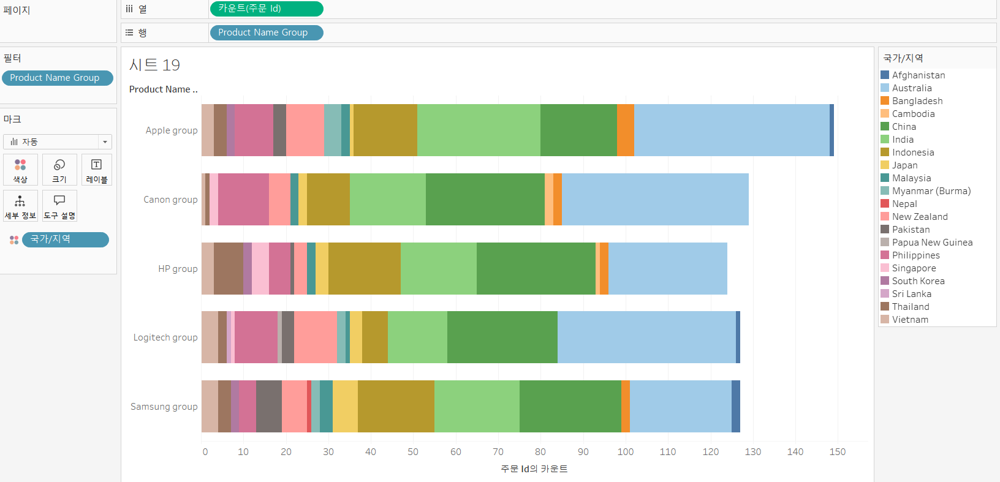