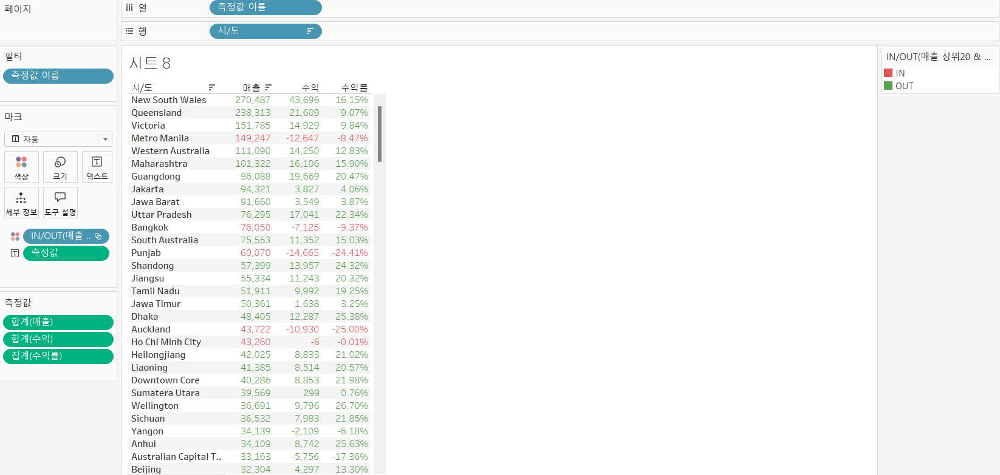

# Fourth Study Week

- 30강: [계층](#30-계층)

- 31강: [집합](#31-집합)

- 32강: [결합집합](#32-결합집합)

- 33강: [계산된 필드](#33-계산된-필드)

- 34강: [행수준계산](#34-행수준계산)

- 35강: [집계계산](#35-집계계산)

- 36강: [테이블계산](#36-테이블계산)

- 37강: [퀵테이블계산(1)](#37-퀵테이블계산1)

- 38강: [퀵테이블계산(2)](#38-퀵테이블계산2)

- [문제1](#문제-1)

- [문제2](#문제-2)

- [문제3](#문제-3)

## Study Schedule

| 강의 범위     | 강의 이수 여부 | 링크                                                                                                        |
|--------------|---------|-----------------------------------------------------------------------------------------------------------|
| 1~9강        |  ✅      | [링크](https://www.youtube.com/watch?v=AXkaUrJs-Ko&list=PL87tgIIryGsa5vdz6MsaOEF8PK-YqK3fz&index=84)       |
| 10~19강      | ✅      | [링크](https://www.youtube.com/watch?v=AXkaUrJs-Ko&list=PL87tgIIryGsa5vdz6MsaOEF8PK-YqK3fz&index=75)       |
| 20~29강      | ✅      | [링크](https://www.youtube.com/watch?v=AXkaUrJs-Ko&list=PL87tgIIryGsa5vdz6MsaOEF8PK-YqK3fz&index=65)       |
| 30~38강      | ✅      | [링크](https://youtu.be/e6J0Ljd6h44?si=nhGbB7GsdOCqj15f)       |
| 39~49강      | 🍽️      | [링크](https://www.youtube.com/watch?v=AXkaUrJs-Ko&list=PL87tgIIryGsa5vdz6MsaOEF8PK-YqK3fz&index=45)       |
| 50~59강      | 🍽️      | [링크](https://www.youtube.com/watch?v=AXkaUrJs-Ko&list=PL87tgIIryGsa5vdz6MsaOEF8PK-YqK3fz&index=35)       |
| 60~69강      | 🍽️      | [링크](https://www.youtube.com/watch?v=AXkaUrJs-Ko&list=PL87tgIIryGsa5vdz6MsaOEF8PK-YqK3fz&index=25)       |
| 70~79강      | 🍽️      | [링크](https://www.youtube.com/watch?v=AXkaUrJs-Ko&list=PL87tgIIryGsa5vdz6MsaOEF8PK-YqK3fz&index=15)       |
| 80~89강      | 🍽️      | [링크](https://www.youtube.com/watch?v=AXkaUrJs-Ko&list=PL87tgIIryGsa5vdz6MsaOEF8PK-YqK3fz&index=5)        |

<!-- 여기까진 그대로 둬 주세요-->

> **🧞‍♀️ 오늘의 스터디는 지니와 함께합니다.**


## 30. 계층

```
계층 : 뷰에서 데이터를 드릴다운을 통해 값을 세부적으로 찾을 때 유용한 방법

- 두 개의 테이블을 선택 한 후 -> 계층 만들기
- 두 필드를 선택 후 마우스 우 클릭 -> 계층 만들기 -> 계층 만들기 창을 띄우고 생성할 수 있음
- 계층 내부에서 정렬 가능
```

## 31. 집합

```
집합 : 사용자가 직접 어떤 조건을 설정하고 그 조건을 기반으로 데이터들을 구분하는 방법

필드에서 마우스 우클릭하여 집합 만들 수 있음

- 집합을 만드는 일반/조건/상위 방법 존재
1) 일반: 그룹 기능과 유사하게 수동으로 데이터를 선택해 묶음
2) 조건: 설정한 조건이 충족되면 데이터를 묶음
3) 상위: 필드 기준 별로 상위 또는 하위 순서로 데이터를 묶음
```

## 32. 결합집합

```
두 가지의 조건을 적용하고 싶은 경우 결합집합을 활용할 수 있음
-> 집합 우클릭 후 결합집합 만들기

- 설정에 따라 교집합,합집합,차집합 수정 가능

(ex) :  매출 5민원 이상 & 수익률 10% 이상
```


## 33. 계산된 필드

```
계산된 필드 : 데이터 원본에 있는 필드를 활용하여 새로운 필드를 만드는 기능

계산된 필드 생성 방법
1) 데이터 패널
2) 분석탭
3) 필드 우클릭 후 
```

## 34. 행수준계산

```
기본 계산 : 데이터 원본에 대한 행 수준 계산 또는 집계 계산을 뜻함
행수준 계산 : 데이터의 각 레코드를 통해 계산하는 방식

필드를 차원과 측정값으로 옮겨서 사용할 수 있음
영상에서 주문 처리 일수 -> 측정값에서 차원값으로 변경해서 사용함
```

## 35. 집계계산

```
집계 계산 : 현재 뷰에서 보이는 기준으로 계산하는 방식
필드 -> 기본 속성 -> 집계를 클릭하면 원하는 집계를 선택할 수 있음
직접 만든 집계 계산 필드는 우클릭으로 변경할 수 없음.

실습) coutd를 통해 고유 주문건수를 구함

```

## 36. 테이블계산

```
테이블 계산 : 뷰에 보이는 내용을 바탕으로 데이터가 계산 되는 방식

- 기본 설정은 테이블(옆으로) 으로 설정되어 있음
- 세모 표시는 테이블 계산 필드를 의미한다.
- 해당 필드에 마우스 우클릭 후 다음을 사용하여 계산을 통해 계산 방향 변경 가능

```

## 37. 퀵테이블계산(1)

```
- 퀵테이블 계산을 활용하면 같은 필드의 다양한 형태를 한 눈에 볼 수 있음

누계 : 집계값을 누적한 값으로 한 번 더 집계해주는 방식 (이중축 활용)
차이 : 측정값이 기준값과 얼마나 차이나는지를 표현 (기준 : 이전/다음/첫 번째/지난)
비율 차이: 측정값들 사이의 성장률 or % 차이를 표현함
구성 비율: 전체에서 각 항목들의 비중을 확인함
백분위수 : 전체에서 각 백분위 표시
```

## 38. 퀵테이블계산(2)

```
- 이동평균 : 이전의 값부터 현재까지 값에 대한 평균 내는 것 (ex : 주식)

- YTD 총계: 특정 시점을 기준으로 해당 연도부터 그 시점까지 총계
    
    +) 연도보다 하위 레벨의 분기, 월 필드가 존재해야 사용할 수 있음

- 전년 대비 성장률 : 같은 월 기준 이전 연도 대비 얼마나 성장했는지 확인할 수 있음

    +) 이전 연도 데이터가 없으면  공백으로 처리

- YTD 성장률 : 특정 시점을 기준으로 이전 연도 대비 얼마나 성장했는지 확인할 수 있음

```

## 문제 1.

규석이는 이제껏 매출을 올리는 데에 힘썼었지만, 왠지 모르게 주머니에 들어오는 돈이 없어 속상합니다. 

그래서 매출이 상위 20곳에 속하지만, 수익률(%)이 마이너스인 시/도를 확인하려고 합니다.

> 수익률은 SUM([수익]) / SUM([매출])로 정의합니다.

어떤 집합을 만들었고, 어떤 결합을 하였는지를 중심으로 기술하고, 결과 자료를 첨부해주세요. 

(텍스트 표 형태이며, 색상으로 위 집합을 구분할 수 있게 만들어주세요.)

<!-- 아래 예시 이미지를 삭제하고, 직접 만든 시트 사진을 올려주세요. 시트의 이름은 본인 이름으로 기입해주세요-->

```
수익률 필드 생성 -> 매출 상위 20위 시/도 집합 생성 -> 수익률 마이너스 시/도 집합 생성
-> 이 두 집합의 결합집합 생성 -> 기타 서식 변경(수익률을 백분율로 변경)
```



## 문제 2.
선희는 주문 Id별로 주문에서 배송까지에 걸리는 날짜 일수가 궁금했습니다. 
그래서 주문 ID별로 주문에서 배송까지 걸리는 일자를 '배송까지 걸린 일수'라는 계산된 필드로 만들고, 이를 마크에 올린 후 확인해보았습니다. 
이때, 계산된 필드의 식은 'DATEDIFF' 함수를 이용하였습니다.

배송까지 걸린 일수 계산을 위한 DATEDIFF 함수 수식을 적어주세요.

```
DATEDIFF('day', [주문 날짜], [배송 날짜])
```


그런데 위 그림처럼 '주문 날짜'와 '배송 날짜'를 함께 행에 올려 확인해보니, 주문날짜와 배송날짜의 차이가 '배송까지 걸린 일수'와 다릅니다.

ID-2021-11126을 보니, 11월 26일 배송에 11월 30일 배송이면 4일 차이인데, 12일이 걸렸다고 하네요. 왜 이런 문제가 생긴걸까요?

```
주문id 당 1개의 상품이 아니라 여러 개가 존재할 수 있기 때문이다. 따라서 주문 처리 일수를 모두 합하여 계산된 것이다.
```

그리고 이를 해결하기 위해서는 어떻게 해야 할까요?

```
계산된 필드에서 측정값을 차원값으로 변경하면 해결된다.
```


## 문제 3.

다음은 Tableau의 다양한 계산을 사용할 수 있는 경우를 빈칸으로 두고 문제를 작성한 것입니다. 각 빈칸에 적합한 계산 유형을 채워보세요.

보기
> **누계, 차이, 비율 차이, 구성 비율, 순위, 백분위수, 이동 평균, YTD 총계, 통합 성장률, 전년 대비 성장률, YTD 성장률**

| 계산 유형               | 설명                                                                 | 사용 예시                                                                                          |
|-------------------------|----------------------------------------------------------------------|-----------------------------------------------------------------------------------------------------|
| 누계           | 데이터의 누적 합계를 계산                                             | 한 기업이 월별 매출 데이터를 누적하여 연간 매출 추이를 보고 싶을 때 사용                                      |
| 차이           | 연속 데이터 포인트 간의 차이를 계산                                    | 한 기업이 월별 매출 데이터에서 전월 대비 매출 증감량을 분석하고 싶은 경우                                        |
| 비율 차이            | 연속 데이터 포인트 간의 비율 변화를 계산                               | 한 기업이 월별 매출 데이터에서 전월 대비 매출 증감률(%)을 분석하고 싶은 경우                                      |
| 구성비율            | 전체에서 각 데이터 포인트의 비율을 계산                                | 한 기업이 전체 매출에서 각 제품군이 차지하는 비율을 보고 싶을 때 사용                                           |
| 순위            | 데이터의 순위를 매깁니다                                              | 한 기업이 제품별 매출 데이터를 순위별로 정렬하여 상위 10개 제품을 분석하고 싶은 경우                              |
| 백분위수            | 데이터의 백분위를 계산                                               | 한 기업이 고객별 구매 금액 데이터를 백분위수로 나누어 상위 25% 고객을 분석하고 싶은 경우                          |
| 이동평균            | 일정 기간의 평균을 계산                                               | 한 기업이 주간 매출 데이터에서 4주 이동 평균을 계산하여 트렌드를 분석하고 싶은 경우                              |
| YTD 총계            | 연초부터 현재까지의 총계를 계산                                      | 한 기업이 월별 매출 데이터를 연초부터 현재까지 누적하여 연간 매출 목표 달성 여부를 분석하고 싶은 경우             |
| 통합성장률            | 일정 기간 동안의 연평균 성장률을 계산                                  | 한 기업이 5년 간 매출 데이터를 바탕으로 연평균 성장률(CAGR)을 계산하고 싶은 경우                                  |
| 전년 대비 성장률            | 전년 동기간 대비 성장률을 계산                                        | 한 기업이 월별 매출 데이터에서 전년 동월 대비 매출 성장률을 분석하고 싶은 경우                                    |
| YTD 성장률            | 연초부터 현재까지의 성장률을 계산                                     | 한 기업이 올해 연초부터 현재까지의 매출이 전년 동기 대비 얼마나 성장했는지 분석하고 싶은 경우                     |

> 사용 예시를 참고하여 실제 경우처럼 생각하며 고민해보아요!
