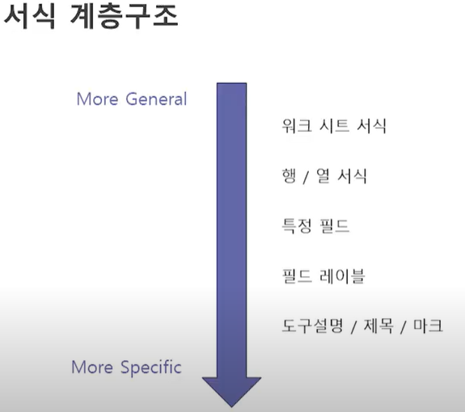
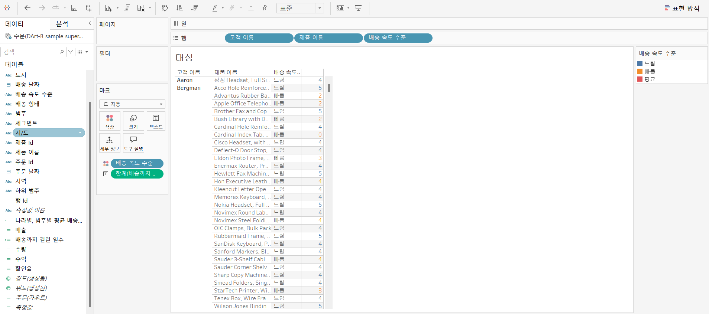
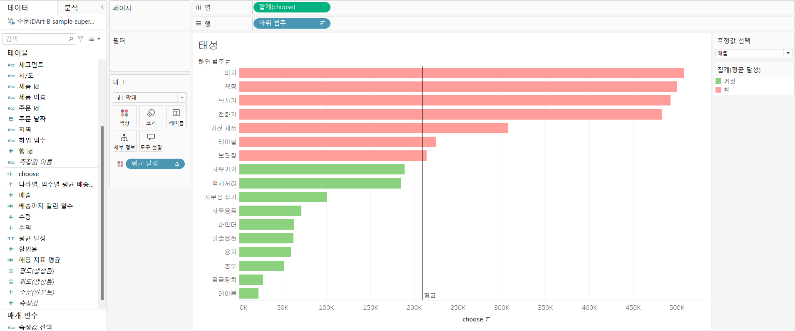

# Fifth Study Week

- 39강: [LOD](#39강-lod)

- 40강: [EXCLUDE](#40-lod-exclude)

- 41강: [INCLUDE](#41-lod-include)

- 42강 : [매개변수](#42-매개변수)

- 43강 : [매개변수 실습](#43-매개변수-실습) 


- 44강: [매개변수 실습](#44-매개변수-실습)

- 45강: [마크카드](#45-워크시트-마크카드)

- 46강: [서식계층](#46-서식-계층)

- 47강: [워크시트](#47-워크시트-서식)

- [문제1](#문제-1)

- [문제2](#문제-2)

## Study Schedule

| 강의 범위     | 강의 이수 여부 | 링크                                                                                                        |
|--------------|---------|-----------------------------------------------------------------------------------------------------------|
| 1~9강        |  ✅      | [링크](https://www.youtube.com/watch?v=AXkaUrJs-Ko&list=PL87tgIIryGsa5vdz6MsaOEF8PK-YqK3fz&index=84)       |
| 10~19강      | ✅      | [링크](https://www.youtube.com/watch?v=AXkaUrJs-Ko&list=PL87tgIIryGsa5vdz6MsaOEF8PK-YqK3fz&index=75)       |
| 20~29강      | ✅      | [링크](https://www.youtube.com/watch?v=AXkaUrJs-Ko&list=PL87tgIIryGsa5vdz6MsaOEF8PK-YqK3fz&index=65)       |
| 30~38강      | ✅      | [링크](https://www.youtube.com/watch?v=e6J0Ljd6h44&list=PL87tgIIryGsa5vdz6MsaOEF8PK-YqK3fz&index=55)       |
| 39~47강      | ✅      | [링크](https://www.youtube.com/watch?v=AXkaUrJs-Ko&list=PL87tgIIryGsa5vdz6MsaOEF8PK-YqK3fz&index=45)       |
| 48~59강      | 🍽️      | [링크](https://www.youtube.com/watch?v=AXkaUrJs-Ko&list=PL87tgIIryGsa5vdz6MsaOEF8PK-YqK3fz&index=35)       |
| 60~69강      | 🍽️      | [링크](https://www.youtube.com/watch?v=AXkaUrJs-Ko&list=PL87tgIIryGsa5vdz6MsaOEF8PK-YqK3fz&index=25)       |
| 70~79강      | 🍽️      | [링크](https://www.youtube.com/watch?v=AXkaUrJs-Ko&list=PL87tgIIryGsa5vdz6MsaOEF8PK-YqK3fz&index=15)       |
| 80~89강      | 🍽️      | [링크](https://www.youtube.com/watch?v=AXkaUrJs-Ko&list=PL87tgIIryGsa5vdz6MsaOEF8PK-YqK3fz&index=5)        |


<!-- 여기까진 그대로 둬 주세요-->

> **🧞‍♀️ 오늘의 스터디는 지니와 함께합니다.**


## 39강. LOD

- LOD(Level of Detail) : 뷰의 세부 수준을 의미
- 현재 뷰에는 영향을 받지 않고, 계산할 수준을 세부적으로 제어 가능
    
- Fixed LOD : 현재 뷰에 있는 차원과 상관 없이 계산된 필드에서 원하는 차원을 따라 계산
  - Fixed에서 설정한 차원이 뷰에 포함되어 있을 때
    - FIXED [지역] : SUM([매출]) 형식으로 필드 생성 가능 (현재 뷰에서 원하는 세부 수준에 따라 필드 생성)
  - Fixed에서 설정한 차원이 뷰에 포함되어 있지 않을 때
    - 현재 뷰에 있지 않은 다른 세부 수준으로 계산된 측정값 필드 생성 가능

## 40. LOD EXCLUDE

```
Exclude: 현재 뷰에서 특정 차원을 제외하고 계산

- 각 제품의 하위 범주에 따라 매출을 보기 위해서는
Fixed를 사용하여 '범주'에 대한 필드를 만들어도 동일한 결과를 얻을 수 있음

- 하나의 범주를 기준으로 다른 하위 범주의 매출을 비교하는 경우
    - 하위 범주에 대해 매출을 반환하는 필드 생성
```

> **🧞‍♀️ FIXED와 EXCLUDE을 사용하는 경우의 차이가 무엇인가요?**

```
FIXED : 현재 뷰와 관계 없이 특정 차원을 사용해 계산하기 떄문에 필터의 영향을 받지 않음
EXCLUDE : 뷰에 있는 차원을 따라 계산하기 떄문에 관련 차원을 필터로 걸면 영향을 받음
```

> **🧞‍♀️ 왜 ATTR 함수를 사용하나요?**

```
EXCLUDE로 만든 계산된 필드의 값을 하위 범주 수준에서 계산하기 위해 ATTR 함수를 사용한다.
```


## 41. LOD INCLUDE

```
INCLUDE LOD : 현재 뷰에서 특정 차원을 추가아여 계산
```

 **🧞‍♀️ 그렇다면 어떤 경우에 각 표현식을 사용하나요? 예시와 함께 적어보아요**

```
Fixed: 뷰에 표시되는 값이 차원일 때 사용함. 차원과 측정값을 반환 가능함
Include & Exclude: 반환 값이 차원 필터의 영향을 받는 경우 사용함
```

## 42. 매개변수


- 매개변수: 고정된 값이 아닌, 동적인 값으로 변경하기 위해 활용하는 기능이다.

- 매개변수는 계산식, 필터, 참조선과 함께 사용됨


> **🧞‍♀️ 집합에도 매개변수를 적용할 수 있나요? 시도해봅시다**

```
집합에도 적용 가능함.
집합 - 상위 - 필드기준 '상위 제품 범주' - 마크 순으로 적용
```

## 43. 매개변수 실습

- 계산식
    - 매개변수를 통해 심플하게 차원 변경할 수 있음

- 측정값을 통해 매개변수 만들기
    - 매개변수 만들기 -> 데이터 유형 문자열 & 허용 가능한 값 "목록" -> 계산식 입력 -> 만든 필드를 필드위로 드래그 앤 드롭

## 44. 매개변수 실습

- 참조선
    - 분석 패널 -> "참조구간" 뷰로 드래그 ->  테이블 주문 날짜 위로 놓기 -> 편집 기능 활용
    - 아까 만든 매개변수들을 표시하고 해당 날짜들을 변경하면 날짜 범위가 하이라트 되어 보임


## 45. 워크시트 마크카드

- 마크: 해당 시트 안에 있는 데이터들, 서식 변경을 하려면 마크카드 사용
- 유형 변경: 마크카드에서 유형을 변경
- 색상: '후광' 옵션의 경우 맵 유형일 때만 사용 가능
- 라인 차트 : '경로' 옵션이 표시, 라인 유형 변경 가능 


## 46. 서식 계층



- 만약 상위 계층의 서식을 설정했을 때, 상위 계층보다 아래 계층의 경우 서식을 변경하게 되면
  아래 계층에 설정한 서식이 적용됨
- 설정한 서식들을 모두 제거할 경우 서식 탭의 워크시트 서식 지우기 -> 한번에 서식 제거 가능

> **🧞‍♀️ 서식계층을 일반적인 것에서 구체적인 것 순서로 기입해보세요**

```
1. 워크 시트 서식
2. 행열 서식
3. 특정 필드
4. 필드 레이블
5. 도구 설명 / 제목 / 마크
```


## 47. 워크시트 서식

- 글꼴
워크시트 내에 있는 텍스트들의 서식을 설정, 총계가 표시될 경우 이에 대한 서식도 별도로 설정 가능

- 맞춤
워크시트 내 표시되어 있는 텍스트들의 정렬, 방향 설정

- 음영
워크시트 내 데이터 셀의 음영 설정, 구간을 세부적으로 설정하여 음영 처리 가능


## 문제 리스트


## 문제 1.

```
가장 많이 주문한 사람들은 물건 배송을 빨리 받았을까요?
조건을 준수하여 아래 이미지를 만들어봆시다.
1) 국가/지역별(이하 '나라'로 통칭), 범주별로 배송일자가 다를 수 있으니 먼저, 나라별/범주별로 평균 배송일자를 설정한 뒤,
2) 각 나라에서 가장 많이 주문한 사람의 이름을 첫 번째 열,
3) 그 사람이 주문한 제품 이름을 2번째 열,
4) 각 상품이 배송까지 걸린 날 수를 표현하고
5) 그리고 만약 배송이 각 나라/범주별 평균보다 빨랐다면 '빠름', 같다면 '평균', 느리다면 '느림' 으로 print 해주세요. 
```



- 행선반에 -> 고객 이름, 제품 이름, 배송 속도 수준 드래그 앤 드랍
- 배송 속도 수준 -> 색상 마크
- 배송까지 걸린 일수 -> 텍스트 마크에 올려서 수치가 나오도록 함

## 문제 2.

```
채원이는 태블로를 쓰실 수 없는 상사분께 보고하기 위한 대시보드를 만들고 싶어요. 

제품 중분류별로 구분하되 매개변수로써 수익, 매출, 수량을 입력하면 저절로 각각 지표에 해당하는 그래프로 바뀌도록 설계하고자 해요.

 어떤 값이 각 지표의 평균보다 낮은 값을 갖고 있다면 색깔을 주황색으로, 그것보다 높다면 파란색으로 표시하고 싶어요. 그 평균값은 각 지표별로 달라야 해요.
```




