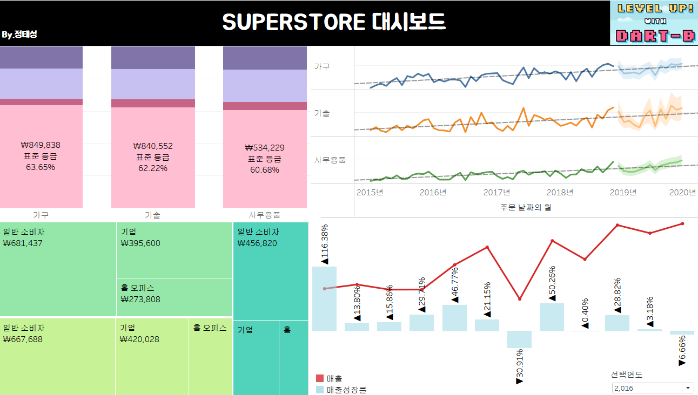

# Sixth Study Week


## Study Schedule
<br>

| 회차 | 강의 범위   | 강의 이수 여부 | 링크                                                                                                     |
|------|-------------|----------------|--------------------------------------------------------------------------------------------------------|
| 1    | 1~7강       | ✅              | [링크](https://www.youtube.com/watch?v=AXkaUrJs-Ko&list=PL87tgIIryGsa5vdz6MsaOEF8PK-YqK3fz&index=84)    |
| 2    | 8~17강      | ✅              | [링크](https://www.youtube.com/watch?v=AXkaUrJs-Ko&list=PL87tgIIryGsa5vdz6MsaOEF8PK-YqK3fz&index=75)    |
| 3    | 18~27강     | ✅              | [링크](https://www.youtube.com/watch?v=AXkaUrJs-Ko&list=PL87tgIIryGsa5vdz6MsaOEF8PK-YqK3fz&index=65)    |
| 4    | 28~37강     | ✅              | [링크](https://www.youtube.com/watch?v=e6J0Ljd6h44&list=PL87tgIIryGsa5vdz6MsaOEF8PK-YqK3fz&index=55)    |
| 5    | 38~47강     | ✅              | [링크](https://www.youtube.com/watch?v=AXkaUrJs-Ko&list=PL87tgIIryGsa5vdz6MsaOEF8PK-YqK3fz&index=45)    |
| 6    | 48~57강     | ✅              | [링크](https://www.youtube.com/watch?v=AXkaUrJs-Ko&list=PL87tgIIryGsa5vdz6MsaOEF8PK-YqK3fz&index=35)    |
| 7    | 58~67강     | 🍽️             | [링크](https://www.youtube.com/watch?v=AXkaUrJs-Ko&list=PL87tgIIryGsa5vdz6MsaOEF8PK-YqK3fz&index=25)    |
| 8    | 68~77강     | 🍽️             | [링크](https://www.youtube.com/watch?v=AXkaUrJs-Ko&list=PL87tgIIryGsa5vdz6MsaOEF8PK-YqK3fz&index=15)    |
| 9    | 78~85강     | 🍽️             | [링크](https://www.youtube.com/watch?v=AXkaUrJs-Ko&list=PL87tgIIryGsa5vdz6MsaOEF8PK-YqK3fz&index=5)     |
---

<br/>
<!-- 여기까진 그대로 둬 주세요-->

> **🧞‍♀️ 오늘은 강의보다 실습과 대시보드 직접 만들기가 더 중요하니, 기록보다는 사고하며 강의를 들어주세요.**

## 48. 워크시트 서식(2)

- 서식
    - 글꼴
        - 워크시트 내 텍스트의 글꼴, 색상, 크기 설정
    - 맞춤
        - 워크시트 내 텍스트의 정렬, 방향 설정
    - 음영
        - 워크시트 내 표시된 데이터 셀에 음영 적용
        - 행/열 색상 교차
    - 테두리
        - 뷰에서 표시된 테이블, 패널, 셀 등을 둘러싸는 라인 서식을 설정
    - 라인
        - 뷰에서 표시된 데이터의 축에 대한 모양 설정

## 49강. 대시보드패널

- 대시보드 채널
- 크기: 현재 대시보드 크기 설정, 고정된 크기 & 자동 크기 & 크기 범위
- 시트: 대시보드에서 사용할 수 있는 워크시트들. 현재 통합 문서에 있는 워크시트. 시트를 대시보드로 드래그 앤 드롭으로 표현
- 개체: 사용자가 만든 시트 외 다른 개체, 이미지 & 웹 페이지


## 50. 대시보드 구성방식

- 바둑판식
    - 격자무늬 구조에 따라 개체 구성
    - 특정 위치에만 추가할 수 있음
    - 다른 개체의 크기도 변경됨

- 부동
    - 개체를 자유롭게 배치 가능
    - 다른 개체의 크기나 모양에 영향을 주지 않음


> **🧞‍♀️ 부동과 바둑판식 방식을 차이를 중점으로 기술해보세요**
```
부동 : 개체의 위치를 자유롭게 배치할 수 있고, 다른 개체에 영향을 주지 않는다.
바둑판식 : 가로 혹은 세로로  특정 위치에만 배치할 수 있다. 다른 개체에 영향을 줌
```


## 51. 대시보드 컨테이너

- 컨테이너: 대시보드 개체들과 워크시트들을 그룹화하고 구성할 수 있는 공간. 

- 가로 컨테이너: 내부 개체를 수평 공간으로 배열할 때
- 세로 컨테이너: 내부 개체를 수직 공간으로 배열할 때
- if 빈페이지 개체는 공백 채우기로 배치

## 52. 레이아웃 패널

- 레이아웃 탭: 대시보드의 개체 속성 변경
- 제목표시
    - 워크시트 제목 표시 여부
- 부동 설정 : 부동 전환 여부
- 테두리 옵션 : 테두리 서식
- 백그라운드 옵션 : 색상 변경
- 여백 옵션
    - 바깥쪽 여백: 컨테이너 모서리와 테두리 사이의 공간
    - 안쪽 여백: 선택된 개체 모서리와 테두리 사이의 공간


## 53. 필터 동작

 1. - 대시보드 탭에서 동작 클릭
    - 동작 추가 클릭
    - 필터 선택
 
 2. - 대시보드 차트 선택
    - 필터로 사용  클릭

- 필터 동작 추가
    - 원본 시트
    - 동작 실행 조건
    - 마우스오버: 차트의 마크 위에 마우스를 가져다 놓으면 나머지 데이터가 해당 마크의 데이터로 변경
    - 선택: 차트의 마크를 클릭했을 때 나머지 데이터가 클릭한 마크의 데이터로 변경
    - 메뉴: 마크를 클릭할 때 마크 도구 설명에 텍스트가 나타나며, 옵션을 선택해야 나머지 데이터가 변경됨
    - 대상 시트: 원본 시트에서 동작을 실행했을 때, 동작이 적용될 워크시트
    - 모든 값 표시: 선택을 해제 -> 대시보드에 전체 데이터가 보이도록 설정


## 54. 대시보드 하이라이터 동작

- 대시보드 -> 동작 -> 동작 추가 -> 하이라이트
- 원하는 제품의 하위범주를 나머지 데이터와 구분하기 위해 사용
- 하이라이트 동작이 작동하려면 마크의 도구설명에 데이터를 포함해야함

## 55. 대시보드 URL

- 대시보드 -> 동작 -> 동작 추가 -> URL
- 도구 설명 속 링크를 클릭하면 해당 사이트로 이동할 수 있음

## 56. 대시보드 시트에 이동 동작

- 대시보드 -> 대시보드 탭 -> 동작 -> 동작 추가(드롭다운) -> 시트로 이동
- 대시보드 2개를 연결할 수 있음

## 57. 매개변수 변경 동작

- 대시보드 → 동작 → 매개변수 변경

## 문제

오늘은 별도의 문제가 없습니다. 


여러 대시보드를 참고하시어, superstore 데이터를 사용해 나만의 대시보드를 제작해주세요.

**단, 워크시트 3개 이상의 그래프를 표시해야 하며 각 시트 간 상호작용성 필터 or 하이라이트 동작은 꼭 추가되어야 합니다**

어떤 부분에 가중을 두었는지, 어떤 사용자 편의성을 고려하였는지에 대한 설명이 필요합니다.



- 대시보드를 만들면서 상품 대분류 및 중분류를 기준으로 여러 그래프들을 표현하는데 중점을 뒀다.
- 대분류 별 매출액과 매출성장률을 표현해보았고 세그먼트 및 대분류 기준으로 합계 매출액을 트리맵으로 표현했다.
